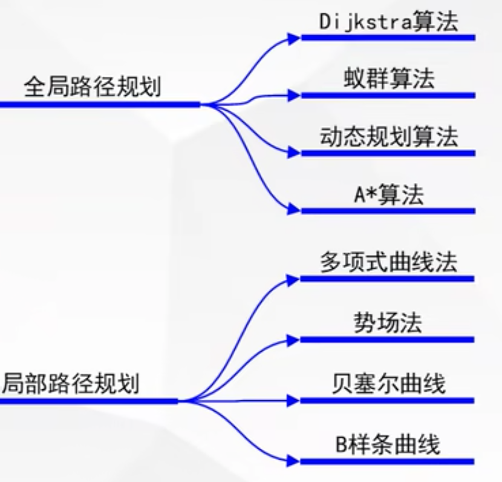
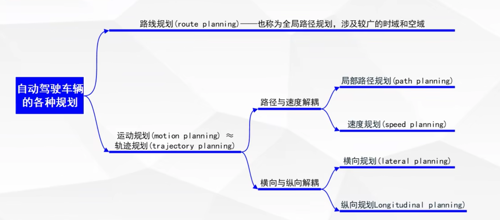
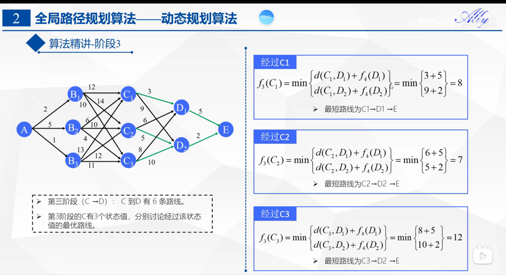
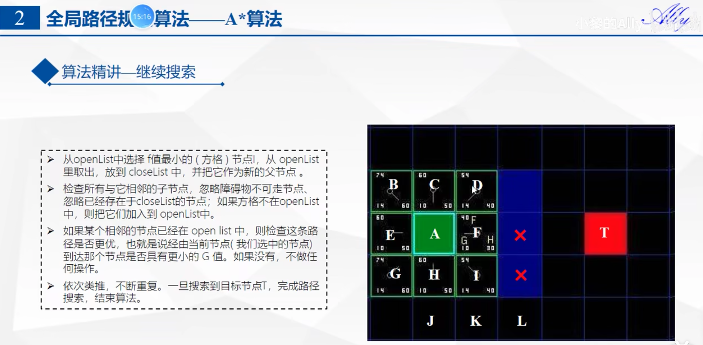
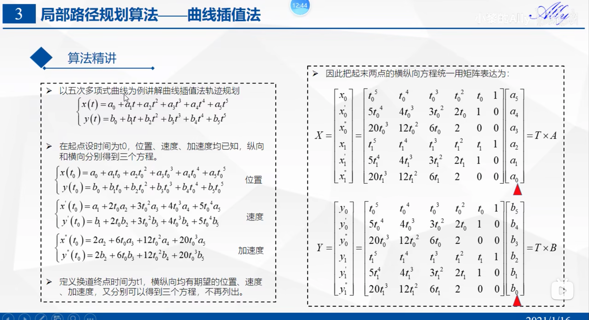
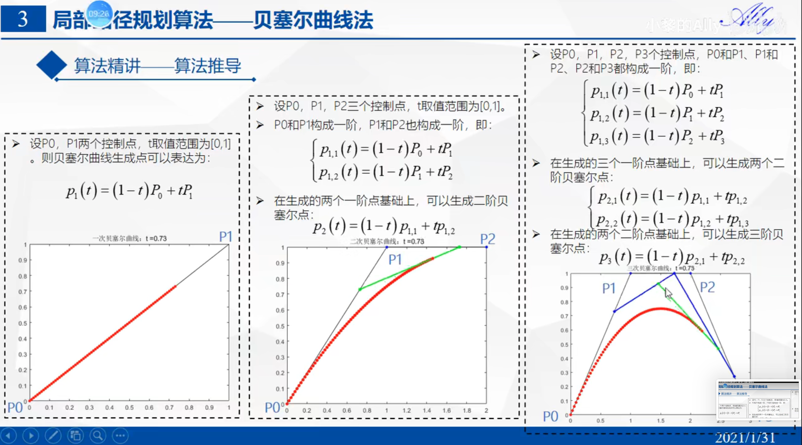
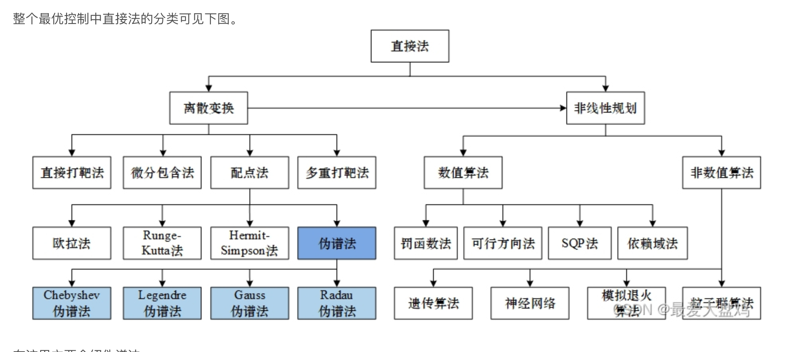

一 B站视频
1 总览
区分全局规划算法和局部规划算法  
 
 

2 Di jkstra算法
- 已知所有节点的相邻关系和相邻权重【权重可以理解为距离/路程/耗费时间】
- 设定两个集合，S和U，S中存放已经确认最短路径的节点，U中存放未确定最短路径的节点，S中只有起点，U中有其他点
- U中的点需要写明到起点的距离，直接相邻的为有效值，不相邻的为正无穷
- 选择U中权重最小的点，放入S中，S中有了新的点
- 计算U中与新点相邻的点的权重，计算方式为【新点自己的权重+相邻权重】，更新为到起点的权重
- 选择U中权重最小的点，再次放入S中，循环往复，直到U中的点完全放入S中，也就找到了最短的路径

 

3 蚁群算法
没有看懂具体的逻辑，只看懂了动画，先跳过

4 动态规划算法
一个最优策略的子策略也会是最优的
- 逆向寻优，正向求解
- 由三层巡航构成
- 1 每个阶段
- 2 i阶段的每个状态
- 3 i+1 阶段的每个状态
我的理解：
动态规划是逆向的，首先是要明确阶段，然后逆向把每个阶段的每个状态到达终点的最优解取到，那么每次求解只需要求解当前阶段到下一阶段的最优解，直到求解到起点，那么就得到了起点到终点的最优解。这个思想比较简单，复杂点在场景的构建上，如何拆分现实的复杂场景去获得动态规划所需要的多阶段和多状态。
 

5 A*算法
- 结合了贪心算法（深度优先）和dijkstra算法（广度优先）
- 首先是要把整个图栅格化
- 也很简单！！
- 路径优劣评价方式为：f(n) = g(n) + h(n)
  - f(n) 越小越好
  - g(n) 为当前已有的路径消耗，可以横纵斜着走，横纵一格消耗为10，斜着一格消耗为14（就是根号2）
  - h(n)为估计的剩余距离，使用曼哈顿距离估算，即只可以横纵两种走法
  - dijkstra算法就是没有h(n)的版本
- 使用两个表来保存节点，类似dijkstra算法，openlist为没有考察过的点，closelist为考察过的点，openlist中仅有父节点的8个子节点
- 第一个closelist中的点为起点，openlist是周围的8个点，计算f(n) = g(n) + h(n)后，将f(n)最小的点放在closelist中
- 有了新的openlist（注意里面不能包含已经在closelist的节点和障碍物），计算新的点的时候，要选择比起点到这个点的f(n)更小的点，因此F是不合适的，要存入I，F要如何处理？？放在closelist中，但是另外用一个数组保存目前的最优路径吗【没错！】
 

6 曲线差值法
- 常见的有多项式曲线，双圆弧曲线，正弦曲线，贝塞尔曲线，B样条曲线，后两种比较复杂，单独归类
- 感觉是归类到横向规划和纵向规划
- 三次多项式曲线：起点和终点的位置和速度
- 五次多项式曲线：起点和终点的位置、速度、加速度
- 七次多项式曲线：位置、速度、加速度、加加速度
- 求解方式见图
 

7 人工势场法
- 斥力场：高山
- 引力场：低谷
- 了解算法的思想，暂时不做细致了解

8 贝塞尔曲线
- 需要考虑轨迹是否容易被车辆跟随，且是否容易生成
- 一阶贝塞尔曲线，二阶贝塞尔曲线，三阶贝塞尔曲线，这是一种生成曲线的方式
 
- 为什么需要用三阶贝塞尔曲线【4个点，如图三】，一阶为一次方程，二阶为二次方程，三阶为三次方程，导一次是速度，导两次是加速度，要加速度连续，所以需要三阶贝塞尔曲线
- TODO：可以用来规划变道，目前代码中是不是用的贝塞尔？
- TODO：与前面的三次曲线五次曲线相违背了，用三次曲线来做规划可以获得加速度，为什么还用5次呢
- TODO：目前所的轨迹规划的方程全部是时间t为变量，横向和纵向分开分别规划

9 B样条曲线
- 为了改进贝塞尔曲线，贝塞尔曲线的缺点：
    - 确定了顶点数量，就确定了阶数
    - 顶点数量多时，曲线次数高
    - 无法进行局部修改
- 没有看懂，似乎是在贝塞尔曲线的基础上加点

二 代码相关
【目前使用的局部路径规划为： lattice 高斯伪谱 QP】

基础知识补充与问题
什么是NLP问题：https://blog.csdn.net/App_12062011/article/details/86538279
如果有dpc目前面临的问题是什么
线性和非线性：线性，直线拟合，非线性，曲线问题
如果高斯伪谱只是优化了求解的速度，那么效果有多好呢
曲率过小：指半径太小

1 高斯伪谱是什么
 
- https://blog.csdn.net/Ruins_LEE/article/details/125681168

